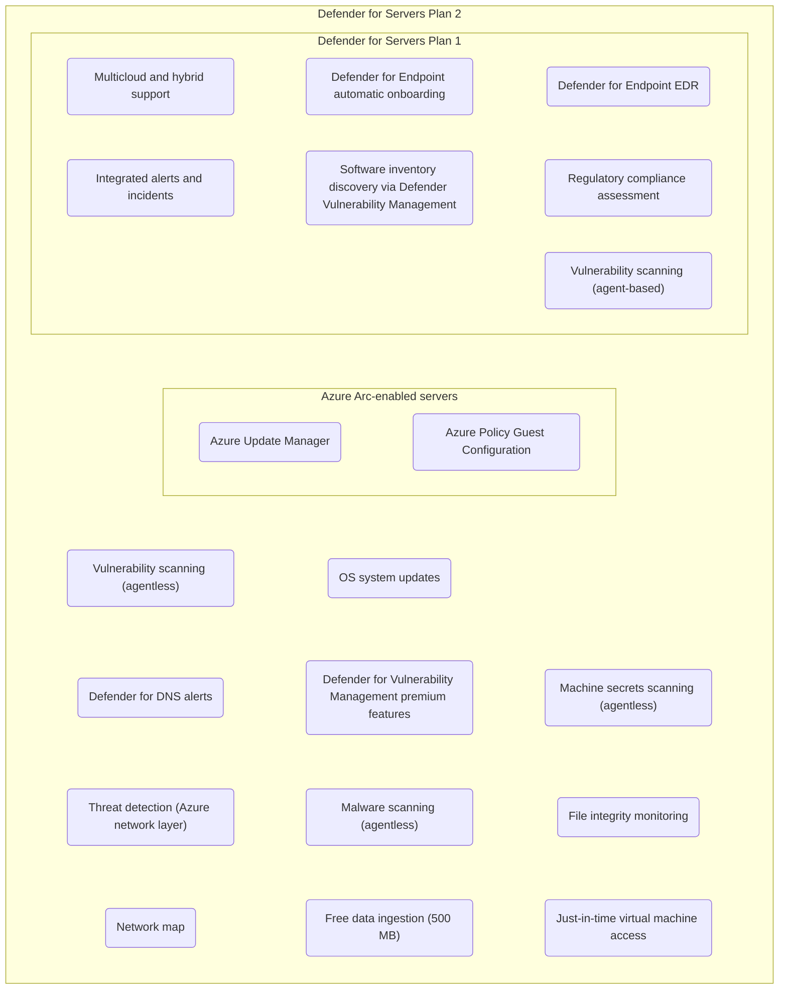

# Overview of Defender for Servers Capabilities

I have been working on some content for a new presentation that is coming up. One of the components is around Defender for Servers, which is a fairly nuanced topic and gets confusing, especially when clients are looking to fully embrace Microsoft's threat protection model.

If you have ever seen Aaron Dinnage's M365 Maps, then you will immediately see they inspired this concept.

There are lots of goodies packed into these bundles and worth understanding beyond just gaining the EDR capabilities. I will link to the GitHub Gist in the comments where you can view the diagram and where each box has a click through link to the Microsoft documentation.

https://gist.github.com/soulemike/29eb73e47d849b1fc647cf3c5a7440d4

Building on this post from yesterday. I also put together a visual representing the many hot topics associated with Microsoft Azure Arc.

There is so much value in these tools, and if you work in infrastructure and operations these are the tools you need to be comfortable with in any cloud or hybrid environment. 

https://gist.github.com/soulemike/56bd92a0265c28081973363676d95f92

```mermaid
flowchart LR
    subgraph arc [Azure Arc #40;$ Additional Costs#41;]
        direction LR
        subgraph mdsp2 [Defender for Servers Plan 2 Entitlements $]
            direction LR
            mdsp1(Defender for Servers Plan 1 $)
            aum1(Azure Update Manager)
            ap(Azure Policy Guest Configuration $)
            ap ~~~ aum1 & mdsp1
        end
        subgraph sa [Software Assurance Entitlements #40;* Exclusive Software Assurance Benefit#41;]
            aum2(Azure Update Manager)
            acti(Azure Change Tracking and Inventory $)
            amc(Azure Machine Configuration $)
            wac(Windows Admin Center in Azure for Arc *)
            rs(Remote Support $*)
            nh(Network HUD *)
            bpa(Best Practices Assessment $*)
            asrc(Azure Site Recovery Configuration $*)
        end
        amal(Azure Monitor $)
        amscom(Azure Monitor SCOM Managed Instance $)
        ms(Microsoft Sentinel $)
        aum4(Azure Update Manager)
        auto(Azure Automation $)
        amc3(Azure Policy Guest Configuration and Change Tracking & Inventory $)
        migrate(Azure Migrate $)
        run(Azure Run Command)
        k8s(Azure Arc-enabled Kubernetes)
        jump(Azure Arc Jumpstart $)
        plink(Azure Private Link $)
        kv(Azure Key Vault $)
        
        subgraph lic [Windows & SQL Server Licensing]
            subgraph esu [Extended Security Updates enabled by Azure Arc]
                wsesu(For Windows Server 2012/R2 $)
                ss12esu(For SQL Server 2012 $)
                ss14esu(For SQL Server 2014 $)
            end
            ss(SQL Server pay-as-you-go enabled by Azure Arc $)
            subgraph ws [Windows Server Pay-as-you-go enabled by Azure Arc $]
                amu3(Azure Update Manager)
                acti2(Azure Change Tracking and Inventory $)
                amc2(Azure Machine Configuration $)
            end
        end

        subgraph core [Core control plane]
            direction LR
            inv(Inventory)
            manage(Manage)
            vm(VM Self-service)
            mi(Managed Identities)
            ext(VM Extensions)
        end

        core ~~~ plink & kv & k8s & amal & amscom & ms
        ms ~~~ jump
        plink ~~~ aum4
        kv ~~~ auto
        amscom ~~~ run
        amal ~~~ migrate
        k8s ~~~ amc3
                
        amc3 <--> amc2 <--> amc <--> ap
        amc3 <--> acti2 <--> acti
        aum4 <--> amu3 <--> aum2 <--> aum1
    end

    classDef blank fill:none,stroke-width:0px;

    click mdsp1 "https://learn.microsoft.com/en-us/azure/defender-for-cloud/defender-for-servers-overview"
    click inv "https://learn.microsoft.com/en-us/azure/azure-arc/servers/organize-inventory-servers"
    click manage "https://learn.microsoft.com/en-us/azure/azure-arc/servers/ssh-arc-overview"
    click vm "https://learn.microsoft.com/en-us/azure/azure-arc/vmware-vsphere/overview"
    click ap,amc,amc2,amc3 "https://docs.azure.cn/en-us/governance/policy/concepts/guest-configuration"
    click acti,acti2 "https://learn.microsoft.com/en-us/azure/automation/change-tracking/overview-monitoring-agent"
    click aum1,aum2,amu3,aum4 "https://learn.microsoft.com/en-us/azure/update-manager/overview"
    click wac "https://learn.microsoft.com/en-us/windows-server/manage/windows-admin-center/azure/manage-arc-hybrid-machines"
    click rs "https://learn.microsoft.com/en-us/windows-server/manage/azure-arc/remote-support-for-windows-server"
    click nh "https://docs.azure.cn/en-us/azure-local/concepts/network-hud-overview"
    click bpa "https://learn.microsoft.com/en-us/windows-server/manage/azure-arc/best-practices-assessment-for-windows-server"
    click asrc "https://learn.microsoft.com/en-us/windows-server/manage/azure-arc/azure-site-recovery-for-windows-server"
    click wsesu "https://learn.microsoft.com/en-us/azure/azure-arc/servers/prepare-extended-security-updates"
    click ss "https://learn.microsoft.com/en-us/sql/sql-server/azure-arc/manage-license-billing"
    click ss12esu,ss14esu "https://learn.microsoft.com/en-us/sql/sql-server/azure-arc/extended-security-updates"
    click amal "https://learn.microsoft.com/en-us/azure/cloud-adoption-framework/scenarios/hybrid/arc-enabled-servers/eslz-management-and-monitoring-arc-server"
    click amscom "https://learn.microsoft.com/en-us/azure/azure-monitor/scom-manage-instance/overview"
    click ms "https://learn.microsoft.com/en-us/azure/azure-arc/servers/scenario-onboard-azure-sentinel"
    click mi "https://learn.microsoft.com/en-us/azure/azure-arc/servers/cloud-native/identity-access"
    click ext "https://learn.microsoft.com/en-us/azure/azure-arc/servers/manage-vm-extensions"
    click auto "https://learn.microsoft.com/en-us/azure/automation/extension-based-hybrid-runbook-worker-install"
    click migrate "https://learn.microsoft.com/en-us/azure/azure-arc/servers/scenario-migrate-to-azure"
    click run "https://learn.microsoft.com/en-us/azure/azure-arc/servers/run-command"
    click jump "https://jumpstart.azure.com/"
    click plink "https://learn.microsoft.com/en-us/azure/cloud-adoption-framework/scenarios/hybrid/arc-enabled-servers/eslz-arc-servers-connectivity#private-link"
    click kv "https://learn.microsoft.com/en-us/azure/cloud-adoption-framework/scenarios/hybrid/arc-enabled-servers/eslz-security-governance-and-compliance#secret-and-certificate-management"
    click k8s "https://learn.microsoft.com/en-us/azure/azure-arc/kubernetes/overview"
```

